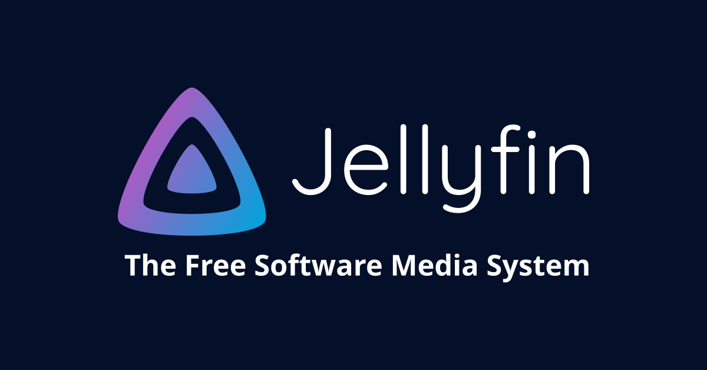

# Jellyfin

<p align="center">
  
</p>

## Introduction

[Jellyfin](https://jellyfin.org/) is a Free Software Media System that puts you in control of managing and streaming your media. It is an alternative to the proprietary Emby and Plex, to provide media from a dedicated server to end-user devices via multiple apps. Jellyfin is descended from Emby's 3.5.2 release and ported to the .NET Core framework to enable full cross-platform support. There are no strings attached, no premium licenses or features, and no hidden agendas: just a team who want to build something better and work together to achieve it.

## Hardware Acceleration

### OpenMAX (Raspberry Pi)

Hardware acceleration users for Raspberry Pi MMAL/OpenMAX will need to mount their /dev/vcsm and /dev/vchiq video devices inside of the container and their system OpenMax libs by passing the following options when running or creating the container:

```
--device=/dev/vcsm:/dev/vcsm
--device=/dev/vchiq:/dev/vchiq
-v /opt/vc/lib:/opt/vc/lib
```

### V4L2 (Raspberry Pi)

Hardware acceleration users for Raspberry Pi V4L2 will need to mount their /dev/video1X devices inside of the container by passing the following options when running or creating the container:

```
--device=/dev/video10:/dev/video10
--device=/dev/video11:/dev/video11
--device=/dev/video12:/dev/video12
```

## Application Setup

Webui can be found at http://<your-ip>:8096

More information can be found on the official documentation [here](https://jellyfin.org/docs/general/quick-start/).

