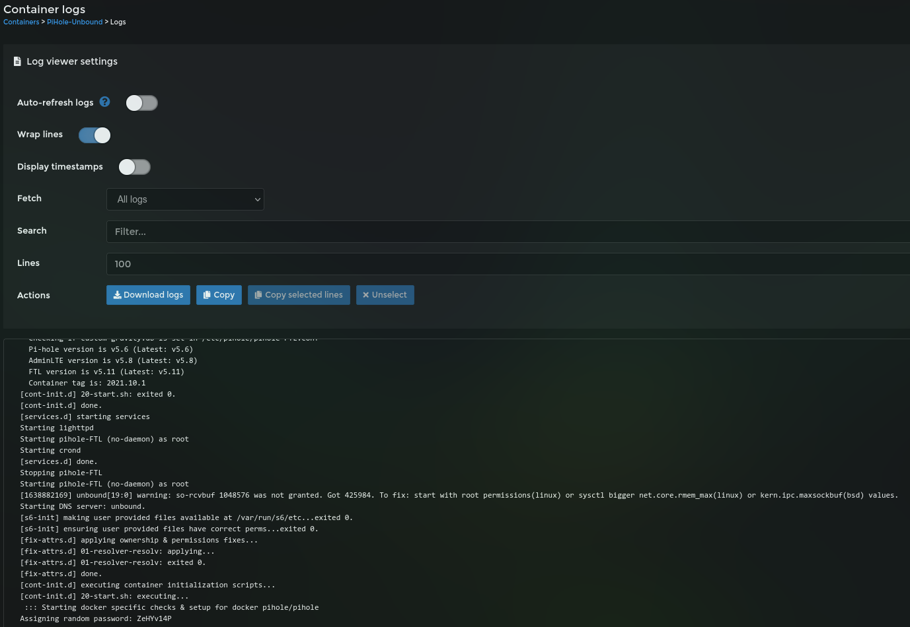
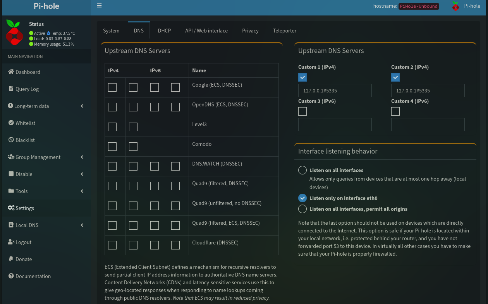
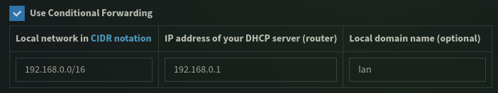

# Install and setup instructions for Pi-Hole DNS Ad Blocker

## Introduction

[Pi-Hole](https://pi-hole.net/) is a network-wide **Ad Blocking** based on [DNS](https://en.wikipedia.org/wiki/Domain_Name_System) filter. It can also act as a [DHCP](https://en.wikipedia.org/wiki/Dynamic_Host_Configuration_Protocol) server.


## Pi-Hole Installation

## Method: 1 (Auto)

1. Run the following script
```
wget -qO- https://raw.githubusercontent.com/akkupy/Homelab/main/scripts/install_pi_hole.sh | bash
```

## Method: 2 (Manual)

### Folder Setup Script

1. First thing we need to do is setup the folder structure. 

Run the following script
```
wget -qO- https://raw.githubusercontent.com/akkupy/Homelab/main/scripts/pi_hole_dir.sh | sudo bash
```

2. Now we need to move into that directory using the following:

```
cd /home/$USER/pi_hole
```

3. We now need to open the docker-compose.yml file using nano editor.

```
nano docker-compose.yml
```
Copy and paste the below Docker-compose exmple into the docker-compose.yml file.

NOTE : Change the TimeZone and Conflicting ports according to your needs.

See example below:
[Docker-compose](https://docs.docker.com/compose/install/) example:

```yaml
version: "3"

# More info at https://github.com/pi-hole/docker-pi-hole/ and https://docs.pi-hole.net/
services:
  pihole:
    container_name: pihole
    image: pihole/pihole:latest
    # For DHCP it is recommended to remove these ports and instead add: network_mode: "host"
    ports:
      - "53:53/tcp"
      - "53:53/udp"
      - "67:67/udp" # Only required if you are using Pi-hole as your DHCP server
      - "4000:80/tcp"
    environment:
      TZ: 'America/Chicago'
      # WEBPASSWORD: 'set a secure password here or it will be random'
    # Volumes store your data between container upgrades
    volumes:
      - './etc-pihole:/etc/pihole'
      - './etc-dnsmasq.d:/etc/dnsmasq.d'
    #   https://github.com/pi-hole/docker-pi-hole#note-on-capabilities
    cap_add:
      - NET_ADMIN # Required if you are using Pi-hole as your DHCP server, else not needed
    restart: unless-stopped
```
4. Once you have done that press “Ctrl + X” then Y to save and “Enter” to exit the nano editor.

5. To deploy the dockers run the following command:

```
sudo docker-compose up -d
```

This will take some time to finish.

6. Once complete you can check that the docker containers exist by typing the following:

```
sudo docker ps
```

Or you can check in Portainer by [logging in via your browser](https://github.com/akkupy/Homelab#login-to-portainer) and navigating to “Containers“.

If you see any problems like “unhealthy” Please restart the container and all should be well.


## Post Installation

### Admin Password

Once deployed, open the container logs, disable `Auto-refresh logs` so you can scroll freely and look for `Assigning random password: XXXXXXXX` to get the Admin password.



You can set a new password opening the Console through Portainer and typing `pihole -a -p` and enter the password when requested.

You can find more commands to run [here](https://docs.pi-hole.net/core/pihole-command/).

With the admin password, go to `http://<Raspberry IP>:4000/admin` to access Pi-Hole web interface and log in.

(Optional): Configure Reverse Proxy using the documentation [here](https://github.com/akkupy/Homelab/blob/main/docs/nginx_proxy_manager.md#first-proxy-host-setup)

Change the DNS settings *Interface listening behavior* to "Listen on all interfaces, permit all origins", if using Docker's default `bridge` network setting. (This can also be achieved by setting the environment variable `DNSMASQ_LISTENING` to `all`)

### Setting Mainstream DNS

Go to `Settings` and select `DNS` on top.



On the left hand side you can select anyone of the know DNS providers or insert a custom one on the right hand side.

You can also set `Use Conditionnal Forwarding` in order for the Pi-Hole to ask your DHCP server the host name of the local IPs. For this to work, define your local network [CIDR](https://en.wikipedia.org/wiki/Classless_Inter-Domain_Routing) (I've used 192.168.0.0/16 that covers all possible subnets within 192.168.x.x range), then insert the IP of your DHCP server (normally your router) and optionally a local domain name.



If you're having loop issues with your router, then you might want to disable this option.

### Point your router or device to Pi-Hole

As each router is different to configure, I'm not going to detail here how it's done. However, you can point your router DNS to Pi-Hole IP (Raspberry IP) and it will use it as the main DNS, blocking any request included on it's blacklist.

Optionally, you can set each device to use a custom DNS and insert the IP of your Raspberry.

You can also refer to [pi-hole router setup documentation](https://docs.pi-hole.net/routers/fritzbox/) for more information.

### Adding more Ad lists

You can add more lists through `Group Management` -> `Adlists`. Then just add the list you want to use.

You can visit [The Big Blocklist Collection](https://firebog.net/) if you want to add more.

