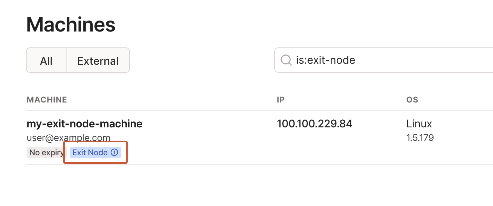
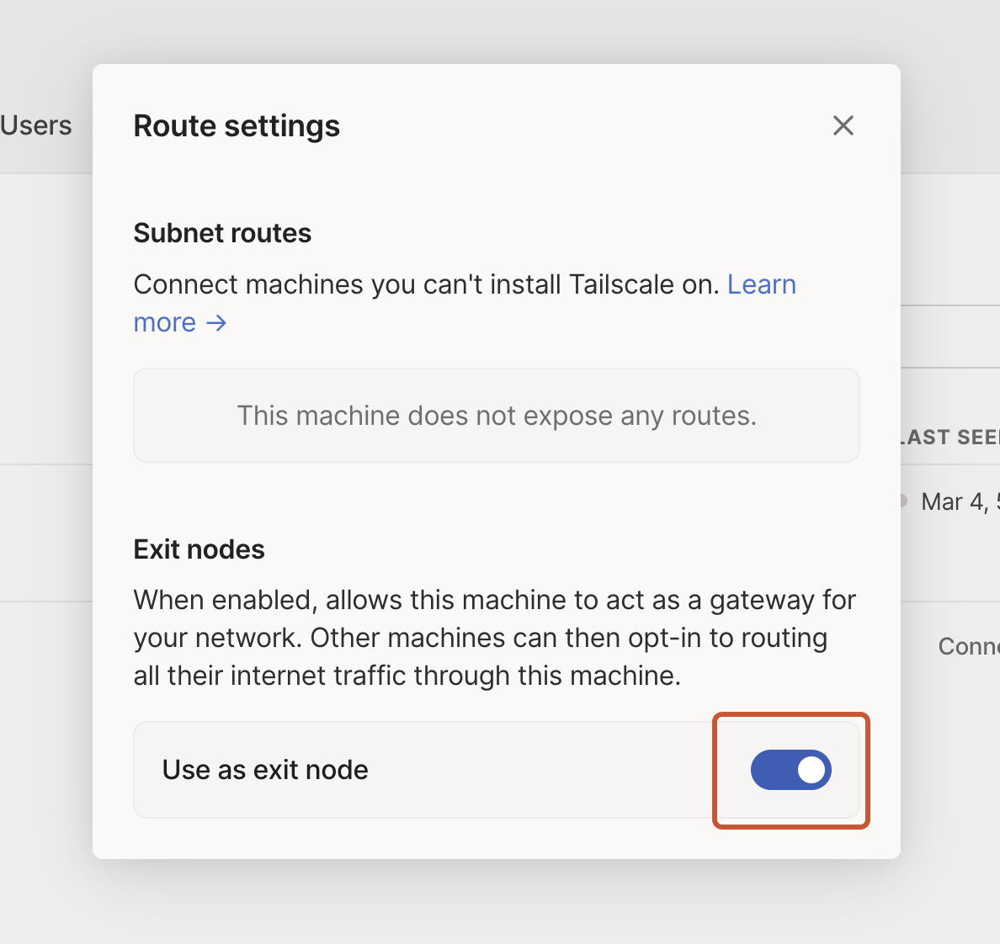

# Tailscale

## Introduction

[Tailscale](https://tailscale.com/) lets you easily manage access to private resources, quickly SSH into devices on your network, and work securely from anywhere in the world.


## Installation
 
Install with one command
```
curl -fsSL https://raw.githubusercontent.com/akkupy/Homelab/main/scripts/install_tailscale.sh | sh
```

Log in to start using Tailscale by running:

```
tailscale up
```
OR

```
sudo tailscale up
```

You’re connected! You can find your Tailscale IPv4 address by running:

```
tailscale ip -4
```
## Post Install Setup

If the device you added is a server or remotely-accessed device, you may want to consider [disabling key expiry](https://tailscale.com/kb/1028/key-expiry/) to prevent the need to periodically re-authenticate.

## (Optional) Setting Up Raspberry Pi as an Exit Node.

1. Enable IP Forwarding

For many distros such as Ubuntu, Debian, CentOS, RHEL, Fedora, and more, you can enable IP forwarding with these commands:

```
echo 'net.ipv4.ip_forward = 1' | sudo tee -a /etc/sysctl.conf
echo 'net.ipv6.conf.all.forwarding = 1' | sudo tee -a /etc/sysctl.conf
sudo sysctl -p /etc/sysctl.conf
```

2. If your Linux node uses firewalld, you may need to also allow masquerading due to a known issue. As a workaround, you can allow masquerading with this command:

```
firewall-cmd --permanent --add-masquerade
```
Other distros may require different steps.

When enabling IP forwarding, ensure your firewall is set up to deny traffic forwarding by default. This is a default setting for common firewalls like ufw and firewalld, and ensures your device doesn’t route traffic you don’t intend.

3. Advertise the device as an exit node.

From the device you’d like to use as an exit node, re-run tailscale up with the --advertise-exit-node flag, along with any other flags you normally use:

```
sudo tailscale up --advertise-exit-node

```
If the device is authenticated by a user who can approve exit nodes in autoApprovers, then the exit node will automatically be approved.

4. Allow the exit node from the admin console.

This step is not required if using autoApprovers.

An admin in your network must now allow this device to be used as an exit node.

Open the machines page in the admin console, and locate the exit node device. You can look for the Exit Node badge in the machines list, or use the is:exit-node filter in the search bar to see all devices claiming to be exit nodes.



Once you’ve found the machine, from the menu, open the **Edit route settings** panel, and enable the **Use as exit node** option.



5. Use the exit node

You can now use the exit node from devices in your network. Each device must enable the exit node separately.

Check out the [doc](https://tailscale.com/kb/1103/exit-nodes/?tab=linux#step-3-use-the-exit-node)

6. Done.
You can verify that your traffic is routed by another device by checking your public IP address using [online tools](https://www.whatismyip.com/). You should see the exit node’s public IP rather than your local device’s IP.

You can disable routing through the exit node at any time by selecting None from the same menu used in step 5.