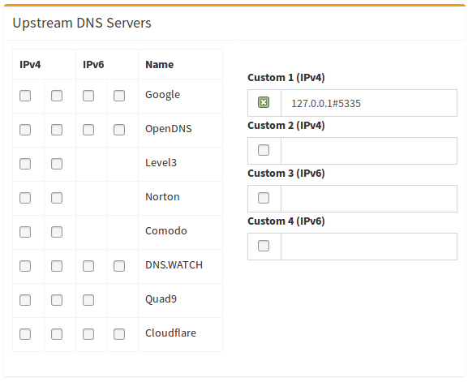

# Unbound


## Introduction

[Unbound](https://nlnetlabs.nl/projects/unbound/about/) is a validating, recursive, caching DNS resolver. It is designed to be fast and lean and incorporates modern features based on open standards.

### What is a recursive DNS server?

The first distinction we have to be aware of is whether a DNS server is authoritative or not. 

If I'm the authoritative server for, e.g., ```akkupy.me```, then I know which IP is the correct answer for a query. Recursive name servers, in contrast, resolve any query they receive by consulting the servers authoritative for this query by traversing the domain. 

Example: We want to resolve ```akkupy.me```. On behalf of the client, the recursive DNS server will traverse the path of the domain across the Internet to deliver the answer to the question.


## Setting up Pi-hole as a recursive DNS server solution¶

We will use ```unbound```, a secure open-source recursive DNS server primarily developed by NLnet Labs, VeriSign Inc., Nominet, and Kirei. The first thing you need to do is to install the recursive DNS resolver:

```
sudo apt install unbound
```

If you are installing unbound from a package manager, it should install the ```root.hints``` file automatically with the dependency ```dns-root-data```. The root hints will then be automatically updated by your package manager.

Optional: Download the current root hints file (the list of primary root servers which are serving the domain "." - the root domain). Update it roughly every six months. Note that this file changes infrequently. This is only necessary if you are not installing unbound from a package manager. If you do this optional step, you will need to uncomment the ```root-hints:``` configuration line in the suggested config file.

```
wget https://www.internic.net/domain/named.root -qO- | sudo tee /var/lib/unbound/root.hints
```
### Configure ```unbound```

Highlights:

 * Listen only for queries from the local Pi-hole installation (on port 5335)
 * Listen for both UDP and TCP requests
 * Verify DNSSEC signatures, discarding BOGUS domains
 * Apply a few security and privacy tricks

 ```/etc/unbound/unbound.conf.d/pi-hole.conf```:

 ```
 server:
    # If no logfile is specified, syslog is used
    # logfile: "/var/log/unbound/unbound.log"
    verbosity: 0

    interface: 127.0.0.1
    port: 5335
    do-ip4: yes
    do-udp: yes
    do-tcp: yes

    # May be set to yes if you have IPv6 connectivity
    do-ip6: no

    # You want to leave this to no unless you have *native* IPv6. With 6to4 and
    # Terredo tunnels your web browser should favor IPv4 for the same reasons
    prefer-ip6: no

    # Use this only when you downloaded the list of primary root servers!
    # If you use the default dns-root-data package, unbound will find it automatically
    #root-hints: "/var/lib/unbound/root.hints"

    # Trust glue only if it is within the server's authority
    harden-glue: yes

    # Require DNSSEC data for trust-anchored zones, if such data is absent, the zone becomes BOGUS
    harden-dnssec-stripped: yes

    # Don't use Capitalization randomization as it known to cause DNSSEC issues sometimes
    # see https://discourse.pi-hole.net/t/unbound-stubby-or-dnscrypt-proxy/9378 for further details
    use-caps-for-id: no

    # Reduce EDNS reassembly buffer size.
    # IP fragmentation is unreliable on the Internet today, and can cause
    # transmission failures when large DNS messages are sent via UDP. Even
    # when fragmentation does work, it may not be secure; it is theoretically
    # possible to spoof parts of a fragmented DNS message, without easy
    # detection at the receiving end. Recently, there was an excellent study
    # >>> Defragmenting DNS - Determining the optimal maximum UDP response size for DNS <<<
    # by Axel Koolhaas, and Tjeerd Slokker (https://indico.dns-oarc.net/event/36/contributions/776/)
    # in collaboration with NLnet Labs explored DNS using real world data from the
    # the RIPE Atlas probes and the researchers suggested different values for
    # IPv4 and IPv6 and in different scenarios. They advise that servers should
    # be configured to limit DNS messages sent over UDP to a size that will not
    # trigger fragmentation on typical network links. DNS servers can switch
    # from UDP to TCP when a DNS response is too big to fit in this limited
    # buffer size. This value has also been suggested in DNS Flag Day 2020.
    edns-buffer-size: 1232

    # Perform prefetching of close to expired message cache entries
    # This only applies to domains that have been frequently queried
    prefetch: yes

    # One thread should be sufficient, can be increased on beefy machines. In reality for most users running on small networks or on a single machine, it should be unnecessary to seek performance enhancement by increasing num-threads above 1.
    num-threads: 1

    # Ensure kernel buffer is large enough to not lose messages in traffic spikes
    so-rcvbuf: 1m

    # Ensure privacy of local IP ranges
    private-address: 192.168.0.0/16
    private-address: 169.254.0.0/16
    private-address: 172.16.0.0/12
    private-address: 10.0.0.0/8
    private-address: fd00::/8
    private-address: fe80::/10
 ```

 Start your local recursive server and test that it's operational:

 ```
 sudo service unbound restart
dig pi-hole.net @127.0.0.1 -p 5335
 ```

 The first query may be quite slow, but subsequent queries, also to other domains under the same TLD, should be fairly quick.

 You should also consider adding

 ```
 edns-packet-max=1232
 ```
to a config file like ```/etc/dnsmasq.d/99-edns.conf``` to signal FTL to adhere to this limit.

### Test validation

You can test DNSSEC validation using

```
dig fail01.dnssec.works @127.0.0.1 -p 5335
dig dnssec.works @127.0.0.1 -p 5335
```

The first command should give a status report of ```SERVFAIL``` and no IP address. The second should give ```NOERROR``` plus an IP address.

### Configure ```Pi-hole```

Finally, configure Pi-hole to use your recursive DNS server by specifying ```127.0.0.1#5335``` as the Custom DNS (IPv4):



(don't forget to hit Return or click on ```Save```)

### Disable ```resolvconf.conf``` entry for ```unbound``` (Required for Debian Bullseye+ releases)

Debian Bullseye+ releases auto-install a package called ```openresolv``` with a certain configuration that will cause unexpected behaviour for pihole and unbound.

 The effect is that the ```unbound-resolvconf.service``` instructs ```resolvconf``` to write ```unbound```'s own DNS service at ```nameserver 127.0.0.1``` , but without the 5335 port, into the file ```/etc/resolv.conf```.
 
  That ```/etc/resolv.conf``` file is used by local services/processes to determine DNS servers configured. You need to edit the configuration file and disable the service to work-around the misconfiguration.

  #### Step 1 - Disable the Service

  To check if this service is enabled for your distribution, run below one. It will show either ```active``` or ```inactive``` or it might not even be installed resulting in a ```could not be found``` message:

  ```
  systemctl is-active unbound-resolvconf.service
  ```

  To disable the service, run the statement below:

  ```
  sudo systemctl disable --now unbound-resolvconf.service
  ```

  #### Step 2 - Disable the file resolvconf_resolvers.conf

  Disable the file resolvconf_resolvers.conf from being generated when resolvconf is invoked elsewhere.

  ```
  sudo sed -Ei 's/^unbound_conf=/#unbound_conf=/' /etc/resolvconf.conf
  sudo rm /etc/unbound/unbound.conf.d/resolvconf_resolvers.conf
  ```
  Restart ```unbound```.

  ```
  sudo service unbound restart
  ```

### Add logging to unbound

> **WARNING :**
> It's not recommended to increase verbosity for daily use, as unbound logs a lot. But it might be helpful for debugging purposes.

There are five levels of verbosity

```
Level 0 means no verbosity, only errors
Level 1 gives operational information
Level 2 gives  detailed operational  information
Level 3 gives query level information
Level 4 gives  algorithm  level  information
Level 5 logs client identification for cache misses
```

First, specify the log file, human-readable timestamps and the verbosity level in the ```server``` part of ```/etc/unbound/unbound.conf.d/pi-hole.conf```:

```
server:
    # If no logfile is specified, syslog is used
    logfile: "/var/log/unbound/unbound.log"
    log-time-ascii: yes
    verbosity: 1
```

Second, create log dir and file, set permissions:

```
sudo mkdir -p /var/log/unbound
sudo touch /var/log/unbound/unbound.log
sudo chown unbound /var/log/unbound/unbound.log
```

On modern Debian/Ubuntu-based Linux systems, you'll also have to add an AppArmor exception for this new file so ```unbound``` can write into it.

Create (or edit if existing) the file ```/etc/apparmor.d/local/usr.sbin.unbound``` and append

```
/var/log/unbound/unbound.log rw,
```

to the end (make sure this value is the same as above). Then reload AppArmor using

```
sudo apparmor_parser -r /etc/apparmor.d/usr.sbin.unbound
sudo service unbound restart
```

Lastly, restart ```unbound```:

```
sudo service unbound restart
```

### Uninstall ```unbound```

To remove ```unbound``` from your system run

```
sudo apt remove unbound
```
Make sure to switch to another upstream DNS server for ```Pi-hole```.

