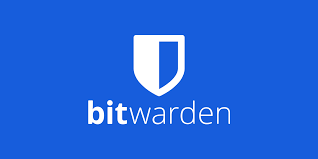

# Vaultwarden

## Introduction

Alternative implementation of the Bitwarden server API written in Rust and compatible with [upstream Bitwarden clients](https://bitwarden.com/download/)*, perfect for self-hosted deployment where running the official resource-heavy service might not be ideal.